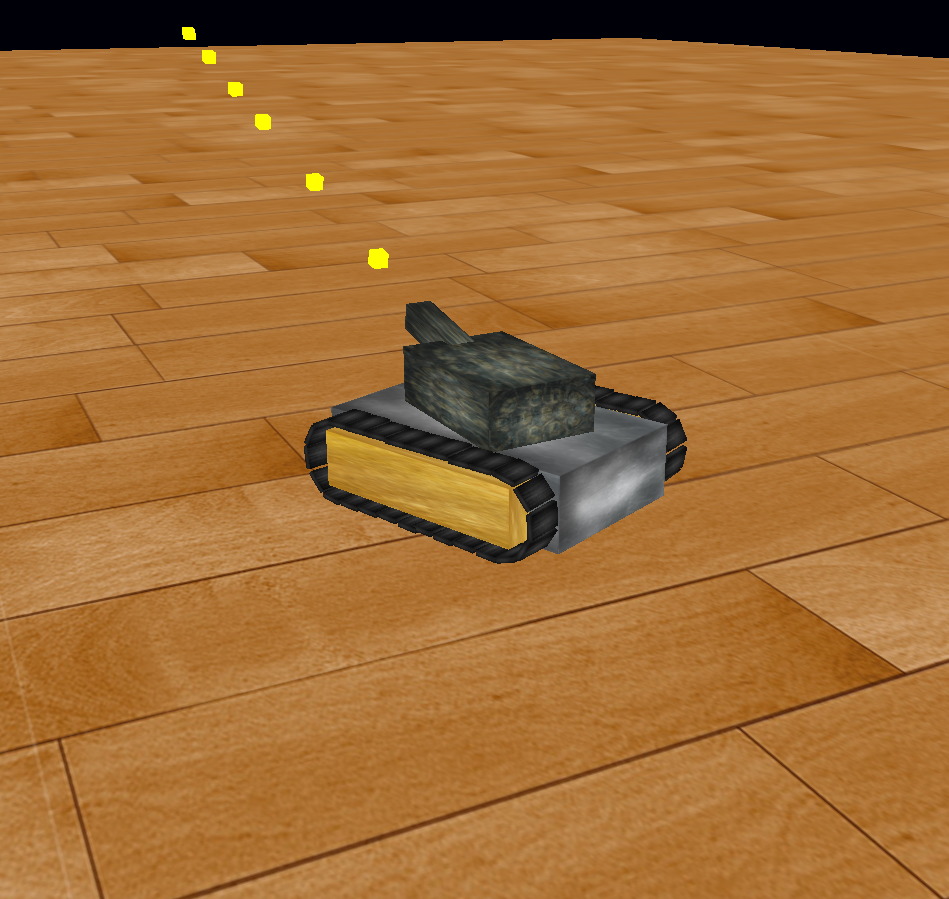

= Machines

    movement of machines

*   tank

== Libraries

*   GLFW
*   OpenGl/glew
*   glm

== Compile

arch linux

    install packages:
        $ pacman -S glew glm glfw-x11 
    Compile with Makefile
        $ cd ./build/
        $ make 
